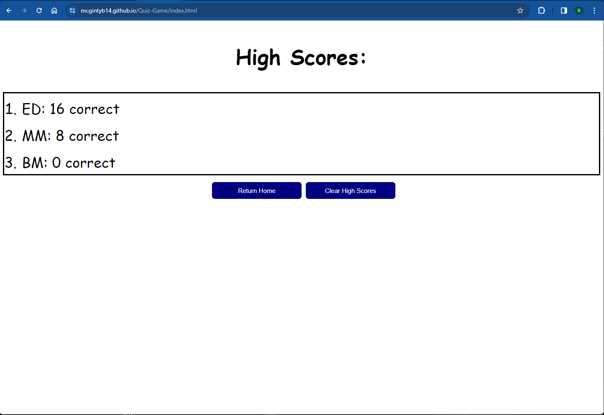

# Quiz Game

## Description
This is a fun trivia quiz game that I have made which includes questions about a range of topics, half of which include questions related to content I have learned throughout the bootcamp so far.

This page combines a mix of HTML, CSS, and complex JavaScript code to provide a dynamic trivia experience which allows you to compete with friends for high scores.

## Usage
To use this site, there are three main interactive functions to call out.

1. To start the trivia quiz, simply click on the "start quiz" button on the homepage of the site
2. Once the questions are displayed, select the correct answers for as many questions as you can before the timer reaches 0 (or answer all of them if you can!)
3. Once the quiz ends, your score will be displayed and you will be prompted to enter your initals (or name) into the input field and hit 'submit.'
4. Once you have submitted your initials, you will be redirected to the 'High Scores' page where all high scores will be displayed in order from most to least correct
5. Once you are on the 'High Scores' page, you will have the option to either return home (which will redirect you to the homepage) or clear the high scores list. This will clear all submissions from local storage and rest the high scores list.

## Screenshots
Screenshot of the homepage

Screenshot of the trivia questions

Screenshot of the High Scores page

## Link
https://mcgintyb14.github.io/Quiz-Game/index.html

## Installation
N/A

## Credits
N/A

## License
[Link to License](LICENSE)
